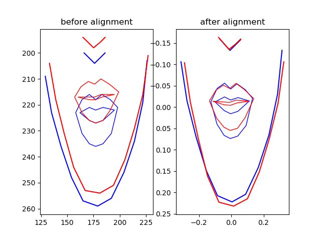

# speech-animation
implementing "A deep learning approach for generalized speech animation" paper using Julia and Knet...

refrence: https://dl.acm.org/citation.cfm?id=3073699

the project is implemented on GRID dataset available at http://spandh.dcs.shef.ac.uk/gridcorpus/

## Data collection
- Used OpenCV and Dlib to extract landmark points on lower face 

- 

